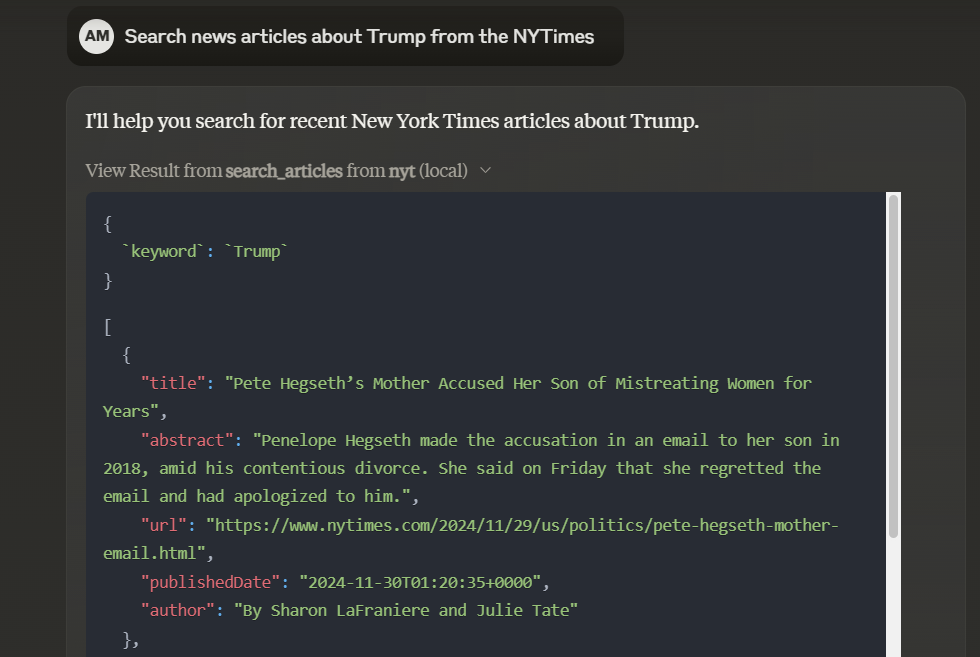

# NYTimes Article Search MCP Server

This is a TypeScript-based MCP server that allows searching for New York Times articles from the last 30 days based on a keyword. It demonstrates core MCP concepts by providing:

- Tools for searching articles
- Integration with the New York Times API



## Features

### Tools
- `search_articles` - Search NYTimes articles from the last 30 days based on a keyword
  - Takes `keyword` as a required parameter
  - Returns a list of articles with title, abstract, URL, published date, and author

## Development

Install dependencies:
```bash
npm install
```

Build the server:
```bash
npm run build
```

For development with auto-rebuild:
```bash
npm run watch
```

### Debugging

Since MCP servers communicate over stdio, debugging can be challenging. We recommend using the [MCP Inspector](https://github.com/modelcontextprotocol/inspector), which is available as a package script:

```bash
npm run inspector
```

The Inspector will provide a URL to access debugging tools in your browser.

## Installation

To use with Claude Desktop, add the server config:

On MacOS: `~/Library/Application Support/Claude/claude_desktop_config.json`
On Windows: `%APPDATA%/Claude/claude_desktop_config.json`

```json
{
  "mcpServers": {
    "nyt": {
      "command": "node",
      "args": ["path/to/your/build/index.js"],
      "env": {
        "NYTIMES_API_KEY": "your_api_key_here"
      }
    }
  }
}
```

## Environment Variables

Create a `.env` file in the root of your project and add your New York Times API key:

```
NYTIMES_API_KEY=your_api_key_here
```

## Running the Server

After building the project, you can run the server with:

```bash
node build/index.js
```

The server will start and listen for MCP requests over stdio.

## License

This project is licensed under the MIT License.